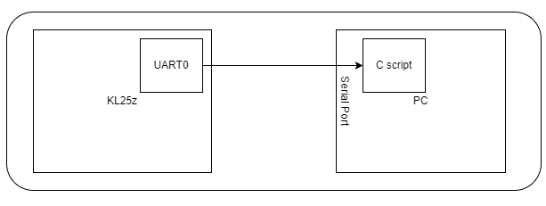
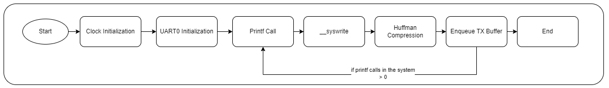
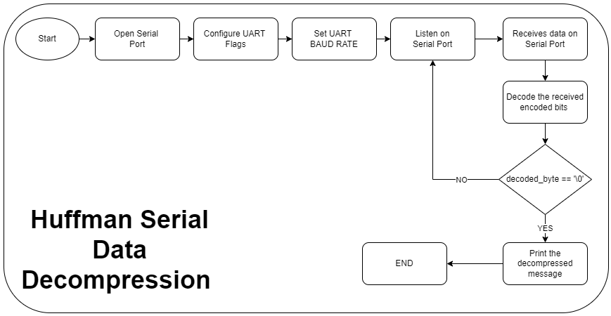
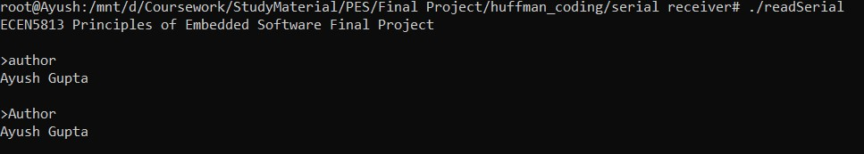
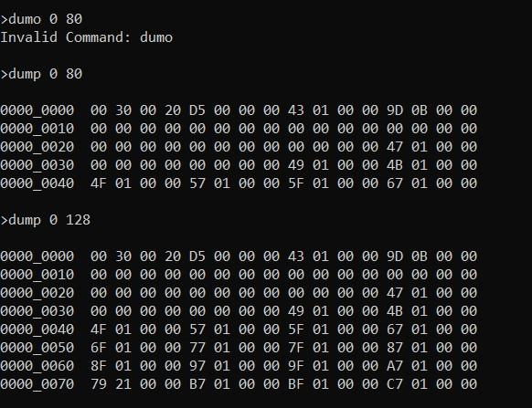
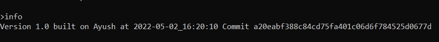

# ECEN 5813 - Huffman Coding for Debug Messages
This repository contains the code for Huffman Coding Algorithm for UART messages on FRDM KL25z development board.

## Overview
Implementation of Huffman Coding algorithm on FRDM KL25Z development board to compress the messages sent over Serial Port.

## Hardware Components
1. FRDM KL25Z Development board
2. A PC with ubuntu operating systems

## Software Components
1. MCU Expresso IDE version - 1.2.0
2. GCC compiler
3. Teraterm/Putty to test the UART Transmitter and Receiver

##  Software Modules
Following are the software modules required to realize the proposed solution:
1. <b>UART0 module</b>: Initialize the UART0 module on KL25Z to be able to sent out data on the serial port.
2. <b>Huffman Coding Algorithm module</b>: This module will have all the Huffman coding logic and to be called before transmitting the string on to the serial port.
3. <b>Circular Queue Module</b>: This module will have the implementation of Circular Queue which will act as a buffer, required to store the transmitting data.
4. <b>Test Huffman Module</b>: This module will have the automated test cases to verify the Huffman Coding Algorithm.
5. <b>Test Circular Queue Module</b>: This module will have the automated test cases to verify the working of Circular Queue.

## Technologies Involved
1. Huffman Coding (Data Compression Technique)
2. Circular Buffers (to store the messages to be sent over the serial port)

## Project Planning
The Project is divided into various submodules and then completed one step at a time. [Here](project_plan.xlsx) is the modular approach that has been followed during the execution of this project.

## Generation of Huffman Map Table
A [python script](huffman%20code%20generator/huffman.py) is used to make the [huffman table for encoding](huffman%20code%20generator/encodeHuffman.txt) and [huffman table for decoding](huffman%20code%20generator/decodeHuffman.txt) using a [corpus](huffman%20code%20generator/corpus.txt). This process is very flexible to do. All the user has to add sentences in the [corpus](huffman%20code%20generator/corpus.txt) and run the python script. It is generate the huffman tree for both encode and decode end. User then has to replace the previous huffman tables with the latest huffman table.

## Project Scope
  All the functionalities which were proposed during the [Project Proposal](AyushGupta_ProjectProposal.pdf) have been completed. Apart from that, on the top of proposed huffman algorithm I have integrated it with assignment 6 command processor.

## Instructions
There are 3 directories in this repository which a user should be aware of.
1. huffman_coding: contains the KL25z software.
      
   To run the KL25z code, open the project in MCUExpresso, select huffman_coding from ```Project Exploler``` > right click and select debug as ```PEMicro Probes```.
2. huffman code generator: this directory has the corpus file and the python script to create encodeHuffmanCode.txt and decodeHuffmanCode.txt which will all be available in this repository after creation.
   
   To run the python script, open terminal and go to this directory (ubuntu system), and run the following command. Make sure you have corpus.txt file in the same directory.

         python3 huffman.py

3. serial receiver: An Ubuntu based C scripts which communicates with KL25Z using serial port.
   
   To run the software, open terminal in ubuntu and go to this directory. Run the following commands to execute the program.

         gcc read_serial.h read_serial.c main.c -o readSerial

         ./readSerial

<b>Note: Make sure you have readSerial executable running on the ubuntu before starting with KL25Z. The program starts when KL25Z sends a dummy string to the PC. </b>

## Functionalities
1. Following commands are present in the system.
   1. Author: returns the name of the author.
   2. dump <start address> <end address>: returns the hexdump of data from requested memory.
   3. info: return a string in the format "Version 1.0 built on <hostname> at <YYYY-MM-DD_HH:mm:ss> Commit <commit_id>"
   4. compare: Huffman compression stats 
2. Huffman code generator to generate HUFFMAN encode and decode tables. 
3. Develop Huffman algorithm and gluing up with Redlib library to compress data and clearly demonstrate the data compression advantages (in form of a compression statistic).
4. Will develop a C program on the receiving end (PC) to receive debug messages over UART to decode 
the received message and match it with the expected output. This program could also keep track of 
compression statistics, since it can track bytes in and bytes out

## Configuring the Serial Port
KL25z: The macro ```BAUD_RATE``` present in ```uart.h``` can easily be configured to work with any Baud Rate.

Ubuntu: The macro ```SERIAL_PORT_KL25Z``` to set the serial port (in my case: /dev/ttyS8) and ```BAUD_RATE``` (in my case B115200) to configure the serial port.

Currently, the serial port is working on <b>115200 Baud Rate, no parity and 1 stop bit mode</b>. 

## Software Flow Control
1. System Overview: There is a program running on KL25z which will receive the commands from Serial Port (UART0) and process it. If the command is valid it will send its response back which will be encoded using the Huffman Algorithm. 
   Here is a high-level system overview.
   

2. KL25z: Encode the outgoing messages using HUFFMAN coding technique. The string is currently being compressed in the ```__sys_write``` function associated RedLib library. 
   
   
   
3. PC Front: On the serial front the data is being decompressed using the HUFFMAN TABLE (symbol, code & number of bits). If ```HUFFMAN_END_SYMBOL``` ('\0') is detected, the remaining bits are discarded. 
   
   


### Test Results
The test plan for verifying the Huffman implementation and integration is given in the [Test Plan](test_plan.xlsx).  

Unit test cases were written to verify each step. Following are the tests that are executed on system start-up.
1. Test Huffman Coding Implementation: If system is in ```DEBUG``` mode, [huffman test APIs](huffman_coding/source/test_huffman.c) will execute on the KL25Z, which will execute the Huffman Encoding and Decoding and uses assert statements while comparing the two results. 
2. Test Circular Queue Implementation: If system is in ```DEBUG``` mode, [circular queue test APIs](huffman_coding/source/test_cbfifo.c) will execute on the KL25Z, which will perform the various scenarios on Circular queue and uses assert statements while comparing the results. 
   
   Once these tests are passed, the system proceeds to the command processor part.


Initial scope of this project was to implement the Huffman algorithm. As that part is completed, I jumped on to the assignment 6 and extended it by integrating it with my implementation of Huffman Algorithm to compress the data.
    
3. The commands are kept as it is from assignment 6. Here are a few screenshots showing the working of various commands.
   
   

   

   

4. A new command which is added to the system is ```compare```. Upon receiving this command the stats related to Huffman will be displayed on the terminal. Below is the picture depicting the same. 

      

### Code Explanantion

https://user-images.githubusercontent.com/89823539/166399931-e08a477d-55db-49d2-a3ed-e65b5351f48d.mp4

### Demo

https://user-images.githubusercontent.com/89823539/166399957-317955ea-bc14-4a01-a92c-930349ffb0e4.mp4

### Stats 
https://user-images.githubusercontent.com/89823539/166399960-c058b555-ed9f-4b0e-b59c-b196044652ef.mp4


### Things to remember
 1. Keep in mind that the characters in the strings below should be a part of the corpus passed to python script. Otherwise there will be no encoded bits and the program will stuck in a loop.
 2. '\0' is used as a HUFFMAN ending character, anything after HUFFMAN_LAST_SYMBOL will be discarded and hence will be lost.


### System Limitations & Possible Future Improvements
1. The corpus that is selected for this application is a bit limited to what it can encode. As the size increases the number of encoded bits increases and with that the time of encoding the bits increases exponentially. A high-quality corpus can be chosen to make improvements. For this application, this corpus can work.
2. The dump function can print upto 130 bytes of data. This is due to the fact that for dump commands I am currently sending one encoded string which is limited by the size of buffers defined in the system. Although the change is minimalistic as all the buffer lengths are defined using a MACRO which are configurable in a single go.
3. Huffman encoding and decoding can be implemented on both the ends to compress the data further.

### References 
1. https://en.wikipedia.org/wiki/Huffman_coding
2. https://brilliant.org/wiki/huffman-encoding/
3. https://www.cyberciti.biz/faq/find-out-linux-serial-ports-with-setserial/
4. https://www.mouser.com/pdfdocs/FRDM-KL25Z.pdf
5. https://www.programiz.com/dsa/huffman-coding
